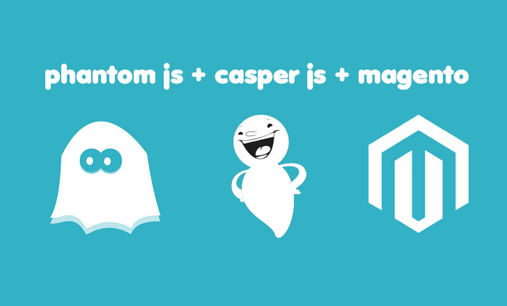

# 

Navigate headlessly through your e-commerce website to test and functionality and take responsive screenshots. 

## Requirements

- Phantomjs (version 2 better)
- CasperJs
- Optional: slimmerjs

## Install

```
$ git clone git://github.com/n1k0/casperjs.git
$ cd casperjs
$ ln -sf `pwd`/bin/casperjs /usr/local/bin/casperjs
$ brew install phantomjs
$ git clone git@github.com:ClaudiuCreanga/magento-automatic-testing-phantomjs.git
```
If you run `casperjs –v` you should receive ` CasperJS version 1.1.0-beta3 at /Users/path/casperjs, using phantomjs version 2.0.0`.

## Usage

Inside the repository run from command line:
```
casperjs test index.js --url="example.com"
```

## API

`BASE_URL` takes the url option from command line
`personal_email` for account login and submitting orders to receive test emails
`viewportSizes` take screenshots at different widths, by default phantomjs opens the browser in mobile view
`get_screenshots` set it to false to not take screenshots and be faster
`responsive` set it to false for fixed width websites

## License

MIT © [Claudiu Creanga](http://claudiucreanga.me)
